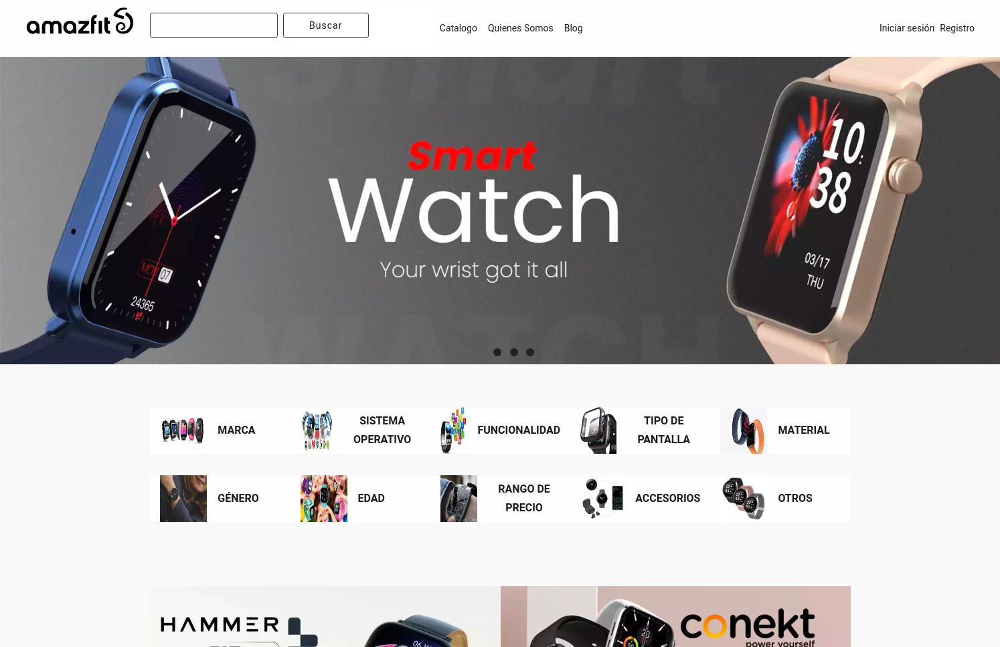

# Drupal E-commerce Project

A ecommerce project make in Drupal.

Drupal version 9.5.10
 
PHP 8.1.16
## Prerequisites

- Docker
- Ddev

## Installation

- git clone https://github.com/ivanpg94/drupal-ecommerce.git
- ddev start
- In web/sites/default/settings.ddev.php change line 46 to: $settings['config_sync_directory'] = '../config/sync';
- ddev composer install
- ddev import-db --src backup-2023-08-08T12-25-47.mysql.gz
- ddev drush updb
- ddev drush cim
- ddev drush cr
